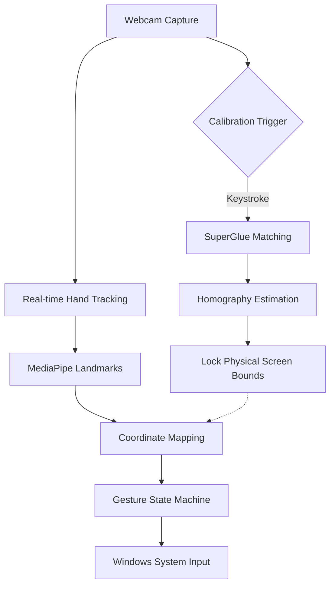

python demo_superglue.py --nms_radius 4 --keypoint_threshold 0.005 --max_keypoints 2048 --superglue outdoor --sinkhorn_iterations 20 --match_threshold 0.05

# VisionTouch: Screen Localization & Gesture Control

## System Pipeline

This project controls the Windows mouse using high-precision screen localization and real-time hand tracking.

## Gestures (single hand)

### Move cursor
- **Index finger up** → cursor follows your index fingertip.
- If index is not up but **middle is up**, cursor follows middle.

### Left click (pinch)
- **Index up + thumb**: pinch (bring thumb near index) then **release quickly** → **Left Click**.
- Cursor **keeps moving even while pinched**.

### Right click
- **Index up + pinky up** (middle + ring down) → **Right Click**.
- Fires immediately when the pose appears (even for a moment). Cooldown prevents rapid repeats.

### Zoom (trackpad-style)
- **Index up + middle up only** (ring down, pinky down) → **Zoom mode**.
- Move index and middle **apart** → **Zoom In**.
- Move them **closer** → **Zoom Out**.

Swipes are horizontal gestures.

- **3-finger swipe**: index + middle + ring up (pinky down). *(Thumb can be up or down.)*
  - Swipe left → **Back** (Alt+Left)
  - Swipe right → **Forward** (Alt+Right)

- **4-finger swipe**: index + middle + ring + pinky up. *(Thumb can be up or down.)*
  - Swipe left → **Virtual Desktop Left** (Ctrl+Win+Left)
  - Swipe right → **Virtual Desktop Right** (Ctrl+Win+Right)

Tip: swipes trigger after a short movement; keep the finger pose steady while moving left/right.

### Pause cursor movement (freeze)
- **All 5 fingers up (open hand)** → cursor movement is **paused for 2 seconds**.
- During the freeze window, actions (click/zoom/swipe) still run, but use the frozen cursor position.

## Gestures (two hands)

### Two-hand zoom
- Show **both hands**.
- On both hands: **index up only** (middle/ring/pinky down).
- Move the two index fingertips **apart** → Zoom In, **together** → Zoom Out.

---

If a gesture doesn’t trigger reliably, it’s usually because one finger is being detected as “up”/“down” inconsistently. Try holding the pose more clearly for a moment, then perform the motion.
